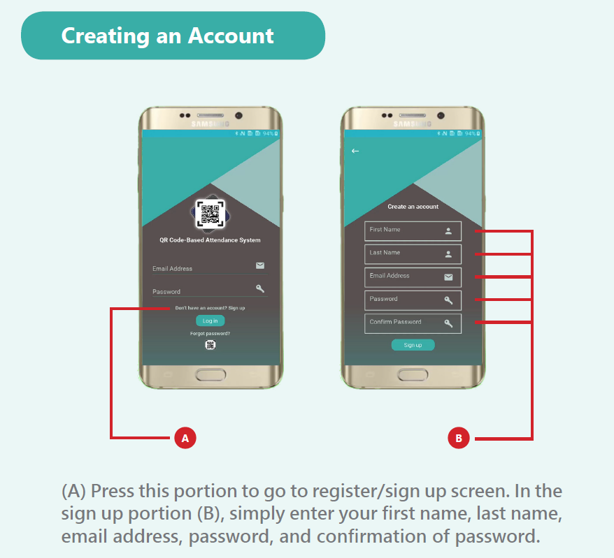
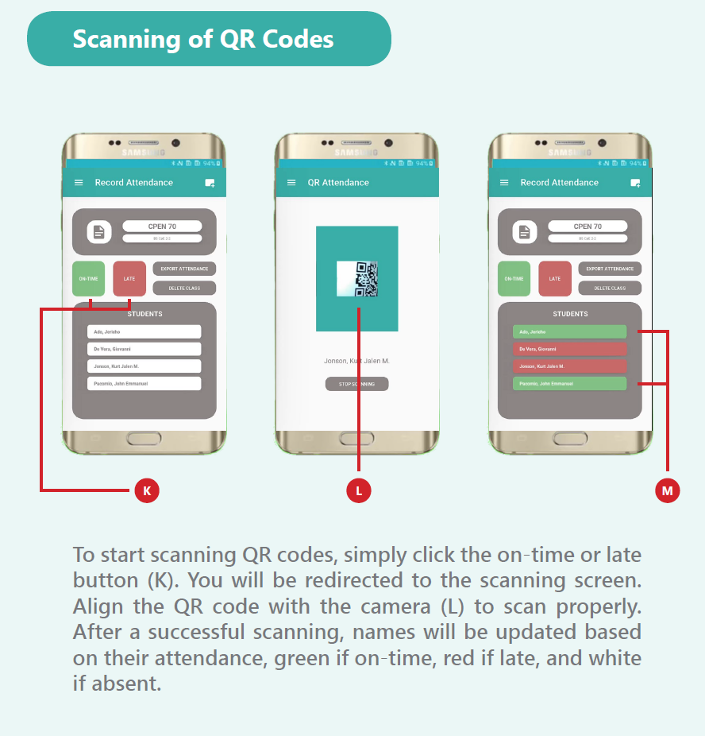

QR Code Generator and Class Attendance System (Built using Python, Kivy, and KivyMD)

QR Code Generator and Class Attendance System is a mobile application for android phones. Through it, university instructors will have an organized and computerized attendance record, wherein the student’s full name becomes the basis to create a QR code. Once the generated QR Code gets scanned under the application, the student will be put into a list under the date of scan. The application can export an excel file containing the attendance record for the day.

# Demo

